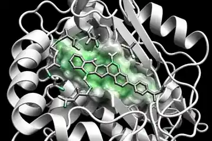

<p align="center">
  
</p>

<h1 align="center">md-forecast</h1>

<p align="center">
  <strong>Forecasting Molecular Dynamics Observables from Partial Trajectories with Time-Series Foundation Models</strong>
</p>

<p align="center">
  
</p>

md-forecast explores whether time-series foundation models can forecast future **molecular-dynamics-derived observables** from partial protein–ligand trajectories with useful accuracy and calibrated uncertainty.

The project is deliberately conservative in scope: it does **not** claim to reconstruct future atomistic coordinates or replace a molecular dynamics engine. The initial goal is to establish whether pretrained time-series models can outperform persistence, statistical baselines, and compact models trained from scratch on physically meaningful MD observables.

Start with the [scientific contract](docs/SCIENTIFIC_CONTRACT.md),
[implementation plan](docs/IMPLEMENTATION_PLAN.md), and
[engineering standards](docs/ENGINEERING_STANDARDS.md).

## Development

Install [uv](https://docs.astral.sh/uv/getting-started/installation/) and run:

```sh
uv sync --locked
uv run md-forecast --version
uv run pytest
```

Python 3.14, the package, and development/documentation tools are provisioned
by the first command. See [development guidance](docs/DEVELOPMENT.md) for
configuration, all quality checks, and the documentation site.

Verified MISATO acquisition is available with `uv run md-forecast download`
(small split files by default; `--mode md` explicitly includes the large MD
artifact). Selected native observables can be exported with
`uv run md-forecast extract-misato --help`; see the
[MISATO adapter](docs/datasets/MISATO_ADAPTER.md) for verified source requirements.
The [data preparation contract](docs/datasets/PREPARATION.md) covers leak-free
splits, lazy forecast windows, and scoped preprocessing. Six synchronous
[CPU baselines](docs/models/BASELINES.md), including train-only NLinear, share
a context-only forecast contract. The optional [Chronos-2 adapter](docs/models/CHRONOS2.md)
provides revision-pinned, synchronous GPU zero-shot inference with native quantiles.
Development-only [MISATO QC](docs/datasets/MISATO_QC.md) is available through
`uv run md-forecast qc-misato --help`, including complete autocorrelation curves.
Versioned [structural geometry](docs/datasets/STRUCTURAL_FEATURES.md) can also be
extracted with `extract-misato --structural-config`, including optional isolated
ligand SASA. No residue/bond identities are guessed from atom codes.
